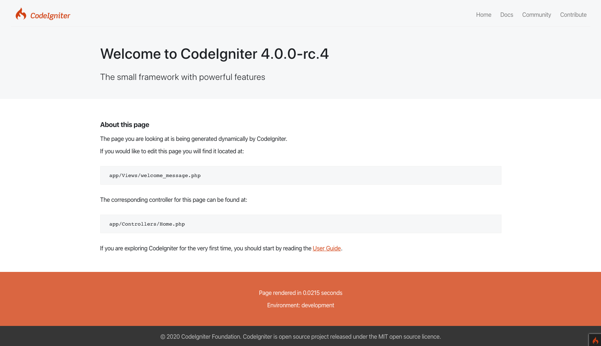

###############
疑难解答
###############

以下是一些常见的安装问题，以及建议的解决方法。

我怎么知道我的安装是否正常？
------------------------------------------------------------------------

在项目根目录，在命令行中::

    php spark serve

``http://localhost:8080`` 然后在浏览器中应显示默认的欢迎页面:

|CodeIgniter4 Welcome|

我必须在我的URL中包含index.php
-------------------------------------

如果 ``/mypage/find/apple`` 类似的URL不起作用，但是 ``/index.php/mypage/find/apple`` 但类似的URL能起作用 ，则听起来您的 ``.htaccess`` 规则（对于Apache）未正确设置，或者 ``mod_rewrite`` Apache的扩展在 ``httpd.conf`` 中已被注释掉。

仅加载默认页面
---------------------------

如果你发现无论你在URL中放入什么内容，只会加载默认页面，可能是你的服务器不支持提供搜索引擎友好URL所需的REQUEST_URI变量。首先，打开 ``app/Config/App.php`` 文件并查找URI协议信息。它会建议你尝试一些备用设置。如果在你尝试此操作后仍然无效，则需要强制CodeIgniter向你的网址添加问号。为此，请打开  ``app/Config/App.php`` 文件并更改::

	public $indexPage = 'index.php';

为这样::

	public $indexPage = 'index.php?';

该教程给出了404错误:(
-------------------------------------------

你无法使用PHP的内置Web服务器来学习本教程。它不处理正确路由请求所需的 ``.htaccess`` 文件。

解决方案：使用Apache为你的站点提供服务，或从项目根目录内置的CodeIgniter等效项 ``php spark serve`` 提供服务。

一个无用的 ``Whoops!`` 页面是怎么回事？
------------------------------------------------------

您发现您的应用程序显示的页面带有 ``Whoops!``， 然后文字行显示“我们似乎遇到了障碍。请稍后再试…”。

这表明您处于生产模式，并且遇到了不可恢复的错误，为了提高安全性，我们不想将其显示给Webapp的查看者。

通过将环境设置为 ``development`` （在.env中），然后重新加载页面，您可以在调试工具栏显示中看到错误。

解决问题后，请不要忘记将环境重设为 ``production``！

CodeIgniter的错误日志
-------------------------------------------------------

CodeIgniter根据 ``app/Config/Logger.php`` 中的设置记录错误消息。

您可以调整错误阈值以查看更多或更少的消息。

默认配置将每日日志文件存储在 ``writable/logs`` 中。检查它们是否符合您的预期效果是个好主意！
