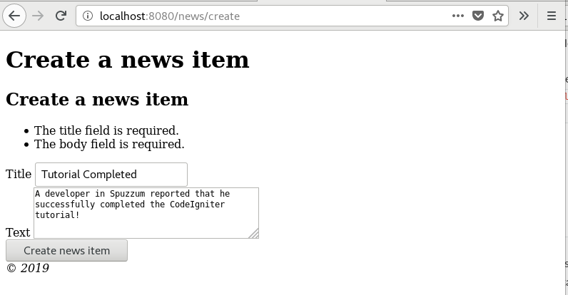
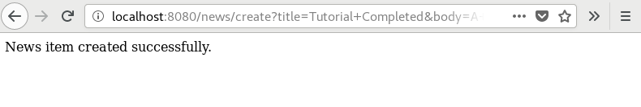

#######################
创建新闻项目
#######################

你现在知道如何使用CodeIgniter从数据库读取数据，但你尚未向数据库写入任何信息。在本节中，你将扩展之前创建的新控制器和模型以包含此功能。

创建表单
-------------------------------------------------------

要将数据输入数据库，你需要创建一个表单，你可以在其中输入要存储的信息。这意味着你将需要一个包含两个字段的表单，一个用于标题，另一个用于文本。你将从模型中的标题中获得slug。在 **app/Views/news/create.php** 创建新视图。

::

    <h2><?= esc($title); ?></h2>

    <?= \Config\Services::validation()->listErrors(); ?>

    <form action="/news/create">

        <label for="title">Title</label>
        <input type="input" name="title" /> 

        <label for="body">Text</label>
        <textarea name="body"></textarea> 

        <input type="submit" name="submit" value="Create news item" />

    </form>

这里只有一件事您可能不熟悉： ``\Config\Services::validation()->listErrors()`` 函数。用于报告与表单验证有关的错误。

回到你的 ``News`` 控制器。你将在此处执行两项操作，检查表格是否已提交以及提交的数据是否通过了验证规则。你将使用 :doc:`form validation <../libraries/validation>` 库来执行此操作。

::

    public function create()
    {
        $model = new NewsModel();

        if (! $this->validate([
            'title' => 'required|min_length[3]|max_length[255]',
            'body'  => 'required'
        ]))
        {
            echo view('templates/header', ['title' => 'Create a news item']);
            echo view('news/create');
            echo view('templates/footer');

        }
        else
        {
            $model->save([
                'title' => $this->request->getVar('title'),
                'slug'  => url_title($this->request->getVar('title')),
                'body'  => $this->request->getVar('body'),
            ]);
            echo view('news/success');
        }
    }

上面的代码添加了很多功能。 首先，我们加载NewsModel。之后，使用控制器提供的辅助函数进行验证$_POST字段。 在这种情况下，标题和文本字段是必填字段。

如上所示，CodeIgniter具有强大的验证库。你可以阅读 :doc:`表单验证 <../libraries/validation>`。

接下来，你可以看到检查表格验证是否成功运行的条件。如果没有，则显示表格，如果提交并传递了所有规则，则调用模型。这将负责将新闻项传递到模型中。这包含一个新函数 ``url_title()`` 。这个函数由 :doc:`URL 辅助函数 <../helpers/url_helper>` 提供， 它将你传递的字符串剥离出来，用短划线(-)替换所有空格，并确保所有内容都是小写字符。这给你留下了一个漂亮的slug，非常适合创建URI。

在此之后，加载视图以显示成功消息。在 **app/Views/news/success.php** 创建一个视图 并写一条成功消息。

这可能很简单:

::

    News item created successfully. 

模型更新
-------------------------------------------------------

剩下的唯一事情就是确保你的模型设置为允许正确保存数据。使用的 ``save()`` 方法将根据主键的存在来确定是否应插入信息，或者行是否已存在且应更新。在这种情况下，没有 ``id`` 字段传递给它，所以它会在它的表中插入一个新行，即 **news**。

但是，默认情况下，模型中的插入和更新方法实际上不会保存任何数据，因为它不知道哪些字段可以安全更新。编辑模型以在 ``$allowedFields`` 属性中为其提供可更新字段的列表。

::

    <?php namespace App\Models;
    use CodeIgniter\Model;

    class NewsModel extends Model
    {
        protected $table = 'news';

        protected $allowedFields = ['title', 'slug', 'body'];
    }

此新属性现在包含我们允许保存到数据库的字段。请注意，我们遗漏了 ``id``？那是因为你几乎不需要这样做，因为它是数据库中的自动递增字段。这有助于防止批量分配漏洞。如果你的模型正在处理你的时间戳，你也可以将其保留。

路由
-------------------------------------------------------

在开始将新闻项添加到CodeIgniter应用程序之前，必须向 **app/Config/Routes.php** 文件添加额外的规则。确保你的文件包含以下内容。这可以确保CodeIgniter将'create'视为一种方法，而不是新闻项目的slug。You can read more about different
routing types :doc:`here </incoming/routing>`.

::

    $routes->match(['get', 'post'], 'news/create', 'News::create');
    $routes->get('news/(:segment)', 'News::view/$1');
    $routes->get('news', 'News::index');
    $routes->get('(:any)', 'Pages::view/$1');

现在将浏览器指向安装CodeIgniter的本地开发环境，并将 ``/news/create`` 添加到URL。添加一些新闻并查看您制作的不同页面。

 

恭喜
-------------------------------------------------------

你刚刚创建了第一个CodeIgniter应用程序！

下面的图片显示了项目的 **app** 文件夹，，以及以绿色创建的所有文件。未显示两个修改后的配置文件（Database & Routes）。
