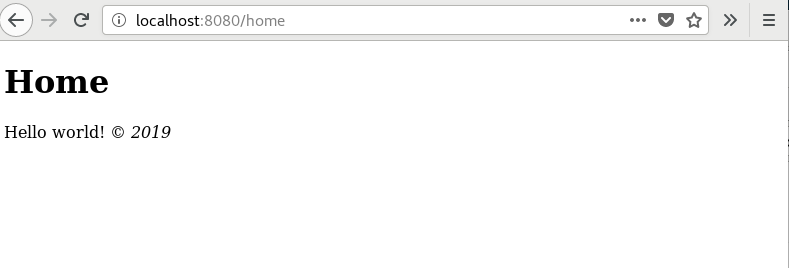

#########################
静态页面
#########################

**Note:** 本教程假设你已经下载好 CodeIgniter，并将其 :doc:`安装 <../installation/index>` 到你的开发环境。

首先你需要新建一个 **controller** 来处理静态页。控制器就是用来帮助你完成工作的一个简单的类，它是你整个 Web 应用程序的"拼接器"。

例如，当访问下面这个 URL 时:

::

	http://example.com/news/latest/10

我们可以推测出有一个名称为 "news" 的控制器。被调用的方法为 "latest"。"latest" 方法的作用应该是查询10条新闻条目并展示在页面上。在MVC模式里，你会经常看到下面格式的 URL:

::

	http://example.com/[controller-class]/[controller-method]/[arguments]

在正式环境下 URL 的格式可能会更复杂，但现在，我们只需要知道这些就够了。

让我们做第一个控制器
-------------------------------------------------------

新建一个文件 **app/Controllers/Pages.php**，然后添加如下代码。

::

    <?php namespace App\Controllers;
    use CodeIgniter\Controller;

	class Pages extends Controller
	{

        public function index()
        {
            return view('welcome_message');
        }

        public function view($page = 'home')
        {
        }
	}

您已经创建了一个名为 ``Pages`` 的类，并带有一个 ``view`` 方法来接受一个名为 ``$page`` 的参数，它也有一个 ``index()`` 方法。同样作为在默认控制器 **app/Controllers/Home.php** 中找到的 ``index()`` 方法； 该方法显示CodeIgniter欢迎页面。

``Pages`` 类继承自 ``CodeIgniter\Controller`` 类，这意味着它可以访问 ``CodeIgniter\Controller`` 类 (*system/Controller.php*) 中定义的方法和变量。

**控制器将是你 Web 应用程序中处理请求的中心** 。和其他的 PHP 类一样，可以在你的控制器中使用 ``$this`` 来访问它。

现在，你已经创建了你的第一个方法，是时候创建一些基本的页面模板了。我们将新建两个 "views" (页面模板) 分别作为我们的页头和页脚。

新建页头文件 **app/Views/templates/header.php** 并添加以下代码:

::

	<!doctype html>
	<html>
	<head>
		<title>CodeIgniter Tutorial</title>
	</head>
	<body>

		<h1><?= esc($title); ?></h1>

页头包含了一些基本的 HTML 代码，用于展示页面主视图之前的内容。同时，它还输出了 ``$title`` 变量，稍后将在控制器中定义。现在，再新建个页脚文件 **app/Views/templates/footer.php** 包含以下代码：

::

		<em>&copy; 2019</em>
	</body>
	</html>

.. note:: 如果您仔细查看 **header.php** 模板，我们将使用 **esc()** 函数。它是CodeIgniter提供的一个全局函数，有助于防止XSS攻击。您可以阅读 :doc:`全局函数 </general/common_functions>` 更多信息。

.. warning:: 本教程中提到了两个 **view()** 函数。一种是使用 ``public function view($page = 'home')`` 创建的类方法和另一种是 ``echo view('welcome_message');`` 用于显示视图。两者在 *技术* 上都是函数。但是当您在类中创建函数时，这称为方法。

在控制器中添加逻辑
-------------------------------------------------------

之前，您使用 ``view()`` 方法设置了一个控制器。该方法接受一个参数，即要加载的页的名称。这个静态页面主体将位于 **app/Views/pages/** 目录。

在该目录中，创建两个名为 **home.php** 和 **about.php** 的文件。在这些文件中，键入一些文本（任何您想要的内容）并保存它们。如果你特别不喜欢原创，试试 "Hello World!"。

为了加载这些界面，你需要检查下请求的页面是否存在。这将是上面创建的 ``Pages`` 控制器中的 ``view()`` 方法的主体：

::

	public function view($page = 'home')
	{
		if ( ! is_file(APPPATH.'/Views/pages/'.$page.'.php'))
		{
		    // Whoops, 我们没有这个页面!
		    throw new \CodeIgniter\Exceptions\PageNotFoundException($page);
		}

		$data['title'] = ucfirst($page); // 首字母大写

		echo view('templates/header', $data);
		echo view('pages/'.$page, $data);
		echo view('templates/footer', $data);
	}

当请求的页面存在时，将给用户加载并展示出一个包含页头页脚的页面。如果不存在，会显示 "404 Page not found" 的错误页面。

此方法第一行用以检查页面是否存在， ``is_file()`` 是原生的 PHP 函数，用于检查某个文件是否存在。``PageNotFoundException`` 是 CodeIgniter 的内置函数，用来展示默认的错误页面。

在页头模板文件中，``$title`` 变量代表页面的自定义标题，它是在方法中被赋值的，但并不是直接赋值给 `title` 变量，而是赋值给 ``$data`` 数组中的 `title` 元素。

最后要做的就是按顺序加载所需的视图，CodeIgniter内置的 ``view()`` 方法将用于执行此操作。 ``view()`` 方法中的第二个参数是用于将值传递给视图。 ``$data`` 数组中的每个值是分配给具有键名的变量。 所以控制器中 ``$data['title']`` 的值，就等于视图中 ``$title`` 的值。

.. note:: 传递给 **view()** 函数的任何文件和目录名称必须匹配实际目录和文件本身的大小写，否则系统将在区分大小写的平台上引发错误。您可以阅读 :doc:`视图 </outgoing/views>` 更多信息。

运行应用
-------------------------------------------------------

准备好测试了吗？ 您无法使用PHP的内置服务器运行该应用，因为它将无法正确处理 ``.htaccess`` 中提供的规则 ``public``，从而无需指定 ``index.php/`` 作为URL的一部分。 CodeIgniter有自己的命令可以使用。

在项目的根目录，运行如下命令行:

::

    php spark serve

将启动可在端口8080上访问的Web服务器。如果设置了位置字段在浏览器的 ``localhost:8080`` 中，您应该会看到CodeIgniter欢迎页面。

现在，您可以在浏览器位置字段中尝试几个URL，以查看您在上面创建的 ``Pages`` 控制器产生的结果...

.. table::
    :widths: 20 80

    +---------------------------------+-----------------------------------------------------------------+
    | URL                             | 显示                                                            |
    +=================================+=================================================================+
    | localhost:8080/pages            | 我们在 `Pages` 控制器中的 `index` 方法的结果，它将显示          |
    |                                 | CodeIgniter "welcome" 页面，因为 "index" 是默认的控制器方法     |
    +---------------------------------+-----------------------------------------------------------------+
    | localhost:8080/pages/index      | CodeIgniter "welcome" 页面，因为我们明确请求的 `index` 方法     |
    +---------------------------------+-----------------------------------------------------------------+
    | localhost:8080/pages/view       | 您在上面创建的 "home"，它是 `view()` 方法的默认 "page" 参数。   |
    +---------------------------------+-----------------------------------------------------------------+
    | localhost:8080/pages/view/home  | 您在上面创建的 "home"，因为我们明确请求的它                     |
    +---------------------------------+-----------------------------------------------------------------+
    | localhost:8080/pages/view/about | 您在上面创建的 "about"，因为我们明确请求的它                    |
    +---------------------------------+-----------------------------------------------------------------+
    | localhost:8080/pages/view/shop  | "404 - File Not Found" 错误页， 因为没有                        |
    |                                 | `app/Views/pages/shop.php`                                      |
    +---------------------------------+-----------------------------------------------------------------+
    

路由
-------------------------------------------------------

控制器已经开始工作了！

使用自定义路由规则，您可以将任何URI映射到任何控制器和方法，从而打破默认的规则: 

::

	$http://example.com/[controller-class]/[controller-method]/[arguments]

让我们来试试。打开路由文件 **app/Config/Routes.php** 然后查找 "Route Definitions" 配置文件部分。

唯一没有注释的行应该是:

::

    $routes->get('/', 'Home::index');

该指令说，没有任何内容指定传入的请求都应该由 ``Home`` 控制器内的 ``index()`` 方法处理。

在'/'的路由指令 **after** 处添加以下行。

::

	$routes->get('(:any)', 'Pages::view/$1');

CodeIgniter 读取路由的规则为从上到下，并将请求映射到第一个匹配的规则。每个规则都是一个正则表达式（左侧）映射到一个由斜线分隔的控制器和方法名（右侧）。当获取到请求时，CodeIgniter 首先查找能匹配到的第一条规则，然后调用相应的可能存在参数的控制器和方法。

有关路由的更多信息可以在URI路由 :doc:`documentation </incoming/routing>` 中找到。

这里，``$routes`` 数组中的第二个规则使用通配符字符串 ``(:any)`` 来匹配 **any** 请求。并将参数传递给 ``Pages`` 类中的 ``view()`` 方法。

现在访问 ``localhost:8080/home``。路由规则是不是正确的将你带到了控制器中的 ``view()`` 方法？太棒了！

你应该看到如下一样:

